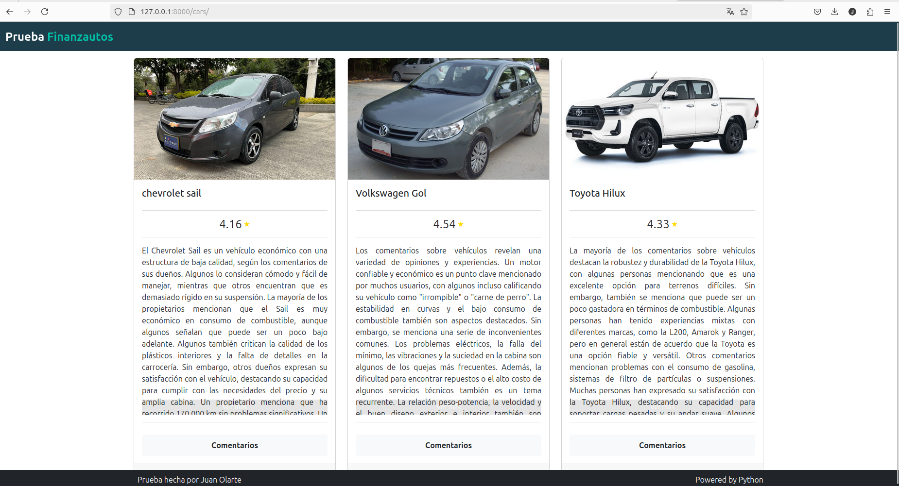

# Proyecto de Análisis y Resumen de Comentarios de Vehículos

## Descripción

Este proyecto realiza scraping de reseñas de vehículos y utiliza técnicas de inteligencia artificial para analizar y resumir los comentarios. Las reseñas se extraen de la web y se procesan para generar resúmenes y análisis de las opiniones de los usuarios.

## Tecnologías Utilizadas

- **Python**: Lenguaje de programación principal.
- **pandas**: Librería para la manipulación y análisis de datos.
- **numpy**: Librería para operaciones numéricas.
- **requests**: Librería para hacer solicitudes HTTP.
- **BeautifulSoup**: Librería para el análisis de HTML y scraping.
- **langchain_community**: Librería para procesamiento de lenguaje natural y generación de PROMPTS.
- **Ollama**: Servidor de modelos de lenguaje para generar resúmenes de texto.

## Requisitos

Asegúrate de tener instalado Python y las siguientes dependencias. También necesitas tener un servidor local de Ollama con el modelo `llama3` en funcionamiento. Puedes instalar todas las dependencias necesarias utilizando el archivo `requirements.txt`.

### Instalación

1. **Clona el repositorio:**

    ```bash
    git clone https://github.com/jolarteu/prueba_finanzautos.git
    cd prueba_finanzautos
    ```

2. **Crea un entorno virtual (opcional pero recomendado):**

    ```bash
    python -m venv venv
    source venv/bin/activate  # En Windows usa `venv\Scripts\activate`
    ```

3. **Instala las dependencias:**

    ```bash
    pip install -r requirements.txt
    ```

4. **Configura y ejecuta el servidor Ollama con llama3:**

    Asegúrate de que tienes Ollama instalado y ejecutando localmente con el modelo `llama3`. Consulta la [documentación de Ollama](https://ollama.com/docs) para detalles sobre la instalación y configuración.

## Uso

1. **Ejecuta el script para obtener y analizar reseñas:**  

   *Este paso es opcional, ya que la base de datos ya contiene datos para los tres vehículos listados. Ejecutar el script actualizaría las imágenes a una calidad baja debido a que las imágenes se obtienen de Google Imágenes.*
   
    Ejecuta el script de scraping y análisis utilizando el comando de Django `manage.py`:

    ```bash
    python manage.py update_vehicle_data
    ```

    el codigo de update_vehicle_data esta en myproject/cars/management/commands/update_vehicle_data.py

    Dentro del codigo esta la lista de vehiculos a buscar, vehicles = [
            ('chevrolet', 'sail'),
            ('Volkswagen', 'Gol'),
            ('Toyota', 'Hilux')
        ]
    Puede ampliar esta lista pero las imagenes se descargaran en baja resolución ya que la funcion las saca de google imagenes.

   El anterior archivo ejecutara internamente el archivo  `myproject/cars/utils/reviews.py`, que se encarga de realizar el scraping de reseñas y generar resúmenes con IA.

2. **Inicia el servidor Django y accede a la URL de las reseñas:**

    Inicia el servidor de desarrollo de Django con el siguiente comando:

    ```bash
    python manage.py runserver
    ```

    Una vez que el servidor esté en ejecución, abre tu navegador web y accede a la siguiente URL para ver las reseñas de los vehículos:

    ```
    http://localhost:8000/cars
    ```

    ## Captura de Pantalla

    Aquí tienes una vista previa de la interfaz de usuario:

    

3. **Configura las variables necesarias (si es necesario):**
   - Asegúrate de que las URLs y las configuraciones específicas del proyecto estén ajustadas en el código según tus necesidades.

## Estructura del Proyecto

- `myproject/cars/utils/reviews.py`: El script para realizar el scraping y análisis.
- `requirements.txt`: Lista de dependencias del proyecto.

## Técnicas de Inteligencia Artificial Utilizadas

- **Modelos de Lenguaje Grande (LLMs)**: El proyecto emplea **Ollama**, un servidor local que ejecuta el modelo de lenguaje **Llama3**. Los LLMs son modelos avanzados de inteligencia artificial diseñados para entender y generar texto en lenguaje natural. **Llama3** es capaz de captar contextos complejos y generar texto coherente y relevante a partir de grandes volúmenes de datos textuales.

- **Generación de Resúmenes**: Utilizamos **Ollama** para analizar y resumir los comentarios extraídos durante el scraping. Este proceso se basa en las capacidades de **Llama3** para sintetizar información y generar resúmenes precisos. La generación de resúmenes en el proyecto incluye:
  - **Definición del Prompt**: Usamos la librería **`langchain_community`** para construir un prompt que guía al modelo en la generación del resumen. **`ChatPromptTemplate`** se utiliza para estructurar el texto que se envía al modelo, especificando cómo deben ser formateados los comentarios y cómo debe ser el resumen.
  - **Interacción con el Modelo**: El prompt se envía a **Ollama**, que ejecuta **Llama3** para procesar el texto y generar un resumen coherente. La salida del modelo destaca los puntos clave y las opiniones más frecuentes, ofreciendo un resumen entre 150 y 200 palabras.
  - **Post-Procesamiento**: El texto generado se ajusta y formatea para integrarse en el DataFrame final que se presenta en el análisis de resultados.

- **Librerías Utilizadas**:
  - **`langchain_community`**: Proporciona herramientas para crear y manejar prompts y salidas generadas por modelos de lenguaje. Utilizamos esta librería para definir la estructura de los prompts (**`ChatPromptTemplate`**) y para interpretar la salida del modelo (**`StrOutputParser`**).
  - **`ChatPromptTemplate`**: Permite definir la estructura y el formato del texto que se envía al modelo de lenguaje. Esto asegura que el modelo reciba las instrucciones precisas para generar el resumen deseado.
  - **`StrOutputParser`**: Se encarga de formatear la salida generada por el modelo, adaptándola al formato requerido para su inclusión en el DataFrame de resultados.

Esta combinación de **Ollama** y **`langchain_community`** permite realizar un análisis detallado y automatizado de las reseñas de vehículos, aprovechando el poder de **Llama3** para obtener resúmenes precisos y útiles a partir de los comentarios de los usuarios.
